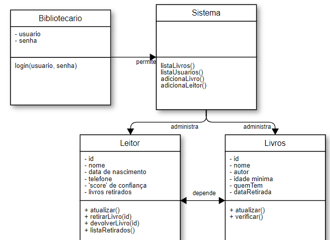

# biblioteca
projeto que simula um sistema bibliotecário: com livros e usuários cadastrados, sistema para retirada e devolução de livros, datas de entregas, multas, etc.

## objetivo
estudo e reforço do aprendizado sobre classes e leitura/gravação de arquivos

## funcionamento
- os códigos serão escritos principalmente em c++
- os cadastros de livros/usuários e informações serão armazenados em arquivos de texto (inicialmente em .txt, por sua simplicidade e praticidade)

## cronograma
- [ ] 1. testes com leitura/gravacao de arquivos de texto
- [ ] 2. planejamento das classes
- [ ] 3. criação dos primeiros arquivos com livros/usuários
- [ ] 4. construção das classes e testes
- [ ] 5. implementação utilizável dos códigos escritos
- [ ] 6. otimização da interface para o usuário
- [ ] 7. comemorar depois que tudo der certo :tada:

## observações
- é esperado que o tempo de desenvolvimento seja maior do que o necessário. esse projeto está sendo desenvolvido em paralelo com minhas atividades escolares, que drenam muito do meu tempo.

## to-do
- .
- .
