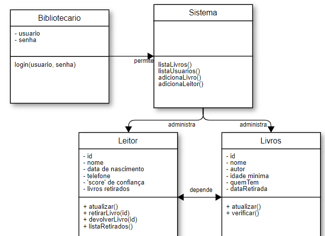

kkkkkk quero refazer tudo isso daqui pq ta terrivel. as classes tem que interagir direito. o tui do passado devia ta tomando uma cervejinha quando fez isso
  
    
      
        
          
# biblioteca
projeto que simula um sistema bibliotecário: com livros e usuários cadastrados, sistema para retirada e devolução de livros, datas de entregas, multas, etc.

## objetivo
estudo e reforço do aprendizado sobre classes e leitura/gravação de arquivos

## funcionamento
- os códigos serão escritos principalmente em c++
- os cadastros de livros/usuários e informações serão armazenados em arquivos de texto (inicialmente em .txt, por sua simplicidade e praticidade)

## cronograma
- [x]  1.  testes com leitura/gravacao de arquivos de texto
- [x]  2.  planejamento das classes
- [x]  3.  criação dos primeiros arquivos com livros/usuários
- [x]  4.  construção da classe livro e testes
- [x]  5.  métodos para adição, remoção e edição de livros
- [ ]  6.  construção da classe usuario e testes
- [ ]  7.  métodos para retirada de livros
- [ ]  8.  sistema de datas de entrega e multas
- [ ]  9.  otimização da interface para o usuário
- [ ]  0.  comemorar depois que tudo der certo :tada:

## observações
- é esperado que o tempo de desenvolvimento seja maior do que o necessário. esse projeto está sendo desenvolvido em paralelo com minhas atividades escolares, que drenam muito do meu tempo.

## to-do
- .
- .

### known-issues
- .
